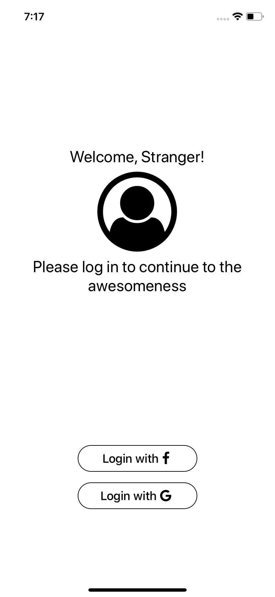
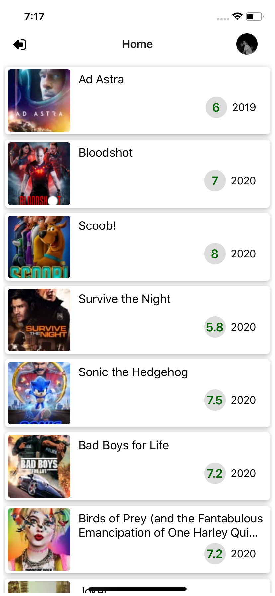
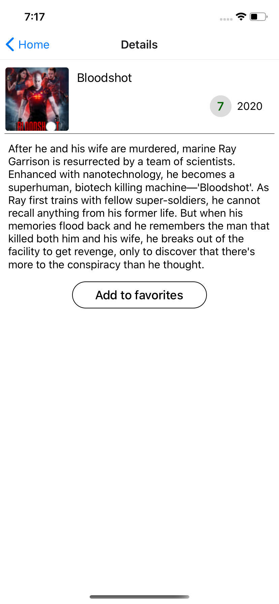
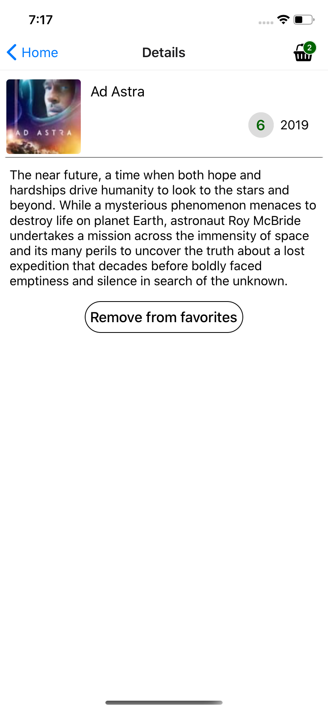

# tmdb react native app

>

## Description

Simple app using [TMDb](https://www.themoviedb.org/) API created with [React Native](https://facebook.github.io/react-native/).

## Getting started

A quick introduction of the minimal setup you need to get running.
It requires Expo CLI;

Add your app configuration in an **.env** file in a root of the project

```
TMDB_API_KEY=YOUR_TMDB_API_KEY
FB_APP_ID=YOUR_FB_APP_ID
GOOGLE_IOS_CLIENT_ID=YOUR_GOOGLE_IOS_CLIENT_ID
GOOGLE_ANDROID_CLIENT_ID=YOUR_GOOGLE_ANDROID_CLIENT_ID
```

and yarn

```shell
yarn && yarn start
```

## Screenshots

<div align="center">






</div>
